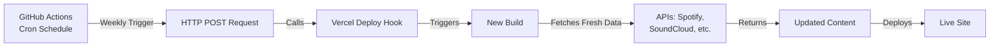

The Jowy Portfolio is designed to automatically fetch fresh content from Spotify, SoundCloud, YouTube, and Google Calendar during each build. Setting up automated weekly rebuilds ensures your portfolio always displays your latest tracks, videos, and events without manual intervention.

## Why Automated Rebuilds?

Your portfolio is a static site that fetches dynamic content during the build process. Without automated rebuilds:

- New tracks won't appear until you manually trigger a build
- Upcoming events won't update
- Video playlists remain static
- Metrics like follower counts become outdated

**Solution**: Schedule weekly rebuilds to automatically fetch and display fresh content.

<Note>
  The portfolio already has a GitHub Actions workflow configured at `.github/workflows/rebuild.yml`. This guide explains how it works and how to customize it.
</Note>

## How It Works

The automated rebuild system uses two components:

1. **GitHub Actions**: A cron job that runs on a schedule
2. **Vercel Deploy Hook**: A webhook URL that triggers a new deployment



## Setting Up Automated Rebuilds

<Steps>
  <Step title="Create a Vercel Deploy Hook">
    Deploy Hooks are unique URLs that trigger a deployment when called.
    
    1. Go to your project in the [Vercel Dashboard](https://vercel.com/dashboard)
    2. Navigate to **Settings** → **Git**
    3. Scroll to **Deploy Hooks**
    4. Enter a name (e.g., "Weekly Rebuild")
    5. Select the branch to deploy (usually `main` or `master`)
    6. Click **Create Hook**
    7. Copy the generated webhook URL
    
    The URL will look like:
    ```
    https://api.vercel.com/v1/integrations/deploy/prj_xxxxx/yyyyy
    ```
    
    <Warning>
      Keep this URL secret! Anyone with access to it can trigger deployments of your site.
    </Warning>
  </Step>

  <Step title="Add Deploy Hook to GitHub Secrets">
    Store the webhook URL securely in GitHub:
    
    1. Go to your GitHub repository
    2. Click **Settings** → **Secrets and variables** → **Actions**
    3. Click **New repository secret**
    4. Name: `VERCEL_DEPLOY_HOOK`
    5. Value: Paste the webhook URL from Vercel
    6. Click **Add secret**
  </Step>

  <Step title="Verify the Workflow File">
    Your repository should already have `.github/workflows/rebuild.yml`. Let's review it:
    
    ```yaml
    name: Reconstrucción Semanal
    on:
      schedule:
        # Runs every Monday at 8:00 AM UTC
        - cron: "0 8 * * 1"
      workflow_dispatch: # Allows manual trigger from GitHub
    
    jobs:
      trigger_deploy:
        runs-on: ubuntu-latest
        steps:
          - name: Llamar al Deploy Hook de Vercel
            run: curl -X POST ${{ secrets.VERCEL_DEPLOY_HOOK }}
    ```
    
    This workflow:
    - Runs every **Monday at 8:00 AM UTC** (rebuild.yml:6)
    - Can be **manually triggered** via GitHub Actions UI (rebuild.yml:7)
    - Makes a **POST request** to your Vercel Deploy Hook (rebuild.yml:14)
  </Step>

  <Step title="Test the Workflow">
    Before waiting a week, test that everything works:
    
    1. Go to your GitHub repository
    2. Click **Actions** tab
    3. Select **Reconstrucción Semanal** workflow
    4. Click **Run workflow** dropdown
    5. Click the green **Run workflow** button
    6. Watch the workflow execute in real-time
    7. Verify a new deployment appears in Vercel
    
    <Note>
      The workflow should complete in a few seconds. The actual build happens in Vercel and takes 1-2 minutes.
    </Note>
  </Step>
</Steps>

## Customizing the Schedule

The default schedule is **every Monday at 8:00 AM UTC**. You can customize this using cron syntax.

### Cron Syntax

```
┌───────────── minute (0 - 59)
│ ┌───────────── hour (0 - 23)
│ │ ┌───────────── day of month (1 - 31)
│ │ │ ┌───────────── month (1 - 12)
│ │ │ │ ┌───────────── day of week (0 - 6) (Sunday to Saturday)
│ │ │ │ │
│ │ │ │ │
* * * * *
```

### Common Schedules

| Description | Cron Expression | Use Case |
|-------------|-----------------|----------|
| Every Monday at 8 AM UTC | `0 8 * * 1` | Weekly updates (default) |
| Every day at midnight UTC | `0 0 * * *` | Daily fresh content |
| Twice weekly (Mon & Thu) | `0 8 * * 1,4` | More frequent updates |
| First day of month | `0 0 1 * *` | Monthly rebuild |
| Every Sunday at 6 AM UTC | `0 6 * * 0` | Weekend preparation |

<Note>
  Use [crontab.guru](https://crontab.guru/) to generate and validate cron expressions. GitHub Actions uses UTC timezone.
</Note>

### Example: Daily Rebuilds

To rebuild every day at midnight UTC:

```yaml
name: Daily Rebuild
on:
  schedule:
    - cron: "0 0 * * *"  # Changed from weekly to daily
  workflow_dispatch:

jobs:
  trigger_deploy:
    runs-on: ubuntu-latest
    steps:
      - name: Trigger Vercel Deploy Hook
        run: curl -X POST ${{ secrets.VERCEL_DEPLOY_HOOK }}
```

## Advanced Configuration

### Multiple Deploy Hooks

If you have staging and production environments:

```yaml
name: Multi-Environment Rebuild
on:
  schedule:
    - cron: "0 8 * * 1"  # Weekly for production
  workflow_dispatch:

jobs:
  deploy_staging:
    runs-on: ubuntu-latest
    steps:
      - name: Deploy to Staging
        run: curl -X POST ${{ secrets.VERCEL_STAGING_HOOK }}
  
  deploy_production:
    runs-on: ubuntu-latest
    needs: deploy_staging  # Wait for staging to finish
    steps:
      - name: Deploy to Production
        run: curl -X POST ${{ secrets.VERCEL_PRODUCTION_HOOK }}
```

### Conditional Rebuilds

Rebuild only if new content exists (requires API checks):

```yaml
name: Conditional Rebuild
on:
  schedule:
    - cron: "0 8 * * 1"
  workflow_dispatch:

jobs:
  check_and_deploy:
    runs-on: ubuntu-latest
    steps:
      - name: Check for new Spotify releases
        id: check
        run: |
          # Add logic to check Spotify API for new releases
          # Set output: echo "new_content=true" >> $GITHUB_OUTPUT
          echo "new_content=true" >> $GITHUB_OUTPUT
      
      - name: Trigger deploy if new content
        if: steps.check.outputs.new_content == 'true'
        run: curl -X POST ${{ secrets.VERCEL_DEPLOY_HOOK }}
```

### Notifications

Get notified when rebuilds complete:

```yaml
name: Rebuild with Notifications
on:
  schedule:
    - cron: "0 8 * * 1"
  workflow_dispatch:

jobs:
  trigger_deploy:
    runs-on: ubuntu-latest
    steps:
      - name: Trigger Vercel Deploy
        id: deploy
        run: |
          curl -X POST ${{ secrets.VERCEL_DEPLOY_HOOK }}
          echo "Deploy triggered at $(date)" >> $GITHUB_STEP_SUMMARY
      
      - name: Send Slack notification
        if: always()
        uses: slackapi/slack-github-action@v1
        with:
          webhook-url: ${{ secrets.SLACK_WEBHOOK }}
          payload: |
            {
              "text": "Portfolio rebuild triggered! Check Vercel for deployment status."
            }
```

## Monitoring Automated Builds

### GitHub Actions Dashboard

1. Go to your repository's **Actions** tab
2. View all workflow runs with timestamps
3. Click any run to see detailed logs
4. Check for failures and debug issues

### Vercel Deployments

1. Open your [Vercel Dashboard](https://vercel.com/dashboard)
2. Click on your project
3. View all deployments with:
   - Trigger source (GitHub Actions hook)
   - Build duration
   - Build logs
   - Deployment preview

<Note>
  Deployments triggered by the Deploy Hook will show "Deploy Hook" as the source in Vercel, making them easy to identify.
</Note>

## Troubleshooting

### Workflow Not Running

**Symptom**: No builds are triggered automatically

**Solutions**:
1. Verify the cron schedule is correct
2. Check that GitHub Actions are enabled for your repository
3. Ensure the workflow file is on the default branch (`main` or `master`)
4. GitHub Actions may have a delay of up to 5 minutes

---

### Deploy Hook Fails

**Symptom**: Workflow runs but Vercel doesn't build

**Solutions**:
1. Verify `VERCEL_DEPLOY_HOOK` secret is set correctly
2. Check the webhook URL is still valid in Vercel settings
3. Ensure the secret has no extra spaces or characters
4. Regenerate the Deploy Hook in Vercel if needed

---

### Build Succeeds But Content Not Updated

**Symptom**: Deployment completes but shows old content

**Possible causes**:
1. **Browser cache**: Hard refresh with `Ctrl+Shift+R` (Windows) or `Cmd+Shift+R` (Mac)
2. **CDN cache**: Vercel CDN cache may take a few minutes to invalidate
3. **API rate limits**: Check Vercel function logs for API errors
4. **Stale cache**: The server-side cache resets with each build, so this shouldn't be an issue

---

### GitHub Actions Quota

**Symptom**: Workflow disabled due to quota

**Solution**: GitHub provides 2,000 free Action minutes per month for private repos (unlimited for public repos). This workflow uses less than 1 minute per run, so quota shouldn't be an issue unless you run it very frequently.

## Best Practices

1. **Start with weekly rebuilds**: Daily rebuilds may be overkill unless you publish content very frequently

2. **Use manual triggers for testing**: Always test the workflow with `workflow_dispatch` before relying on cron

3. **Monitor build times**: If builds take too long, consider optimizing API calls or caching strategies

4. **Check API quotas**: Ensure your weekly rebuilds don't exceed API rate limits (especially YouTube Data API)

5. **Version your workflow**: Commit changes to the workflow file with clear messages explaining schedule changes

6. **Set up notifications**: Add Slack or email notifications for failed workflows so you know immediately if something breaks

## Cost Considerations

### GitHub Actions

- **Public repos**: Unlimited free minutes
- **Private repos**: 2,000 free minutes per month
- **This workflow uses**: ~0.5 minutes per run
- **Weekly cost**: ~2 minutes per month (essentially free)

### Vercel

- **Free tier**: 100 deployments per day
- **This workflow adds**: 4-5 deployments per month
- **Impact**: Negligible on free tier quota

<Note>
  Both GitHub Actions and Vercel's free tiers are more than sufficient for automated weekly rebuilds. You won't incur any costs.
</Note>

## Alternative CI/CD Platforms

While GitHub Actions is the default choice, you can also use:

### GitLab CI

```yaml
# .gitlab-ci.yml
schedule:rebuild:
  only:
    - schedules
  script:
    - curl -X POST $VERCEL_DEPLOY_HOOK
```

### Vercel Cron Jobs (Coming Soon)

Vercel is developing native cron job support that won't require GitHub Actions.

### External Cron Services

Use services like [cron-job.org](https://cron-job.org) or [EasyCron](https://easycron.com):

1. Create an account
2. Add a new cron job
3. Set URL to your Vercel Deploy Hook
4. Configure schedule
5. Set method to POST

## Next Steps

Your portfolio is now fully automated! Consider:

- Monitoring Vercel Analytics to see how users engage with fresh content
- Adding more API integrations to showcase additional platforms
- Creating a custom rebuild notification system
- Documenting your schedule for future reference

Your portfolio will now stay fresh automatically, showcasing your latest work without any manual intervention.
